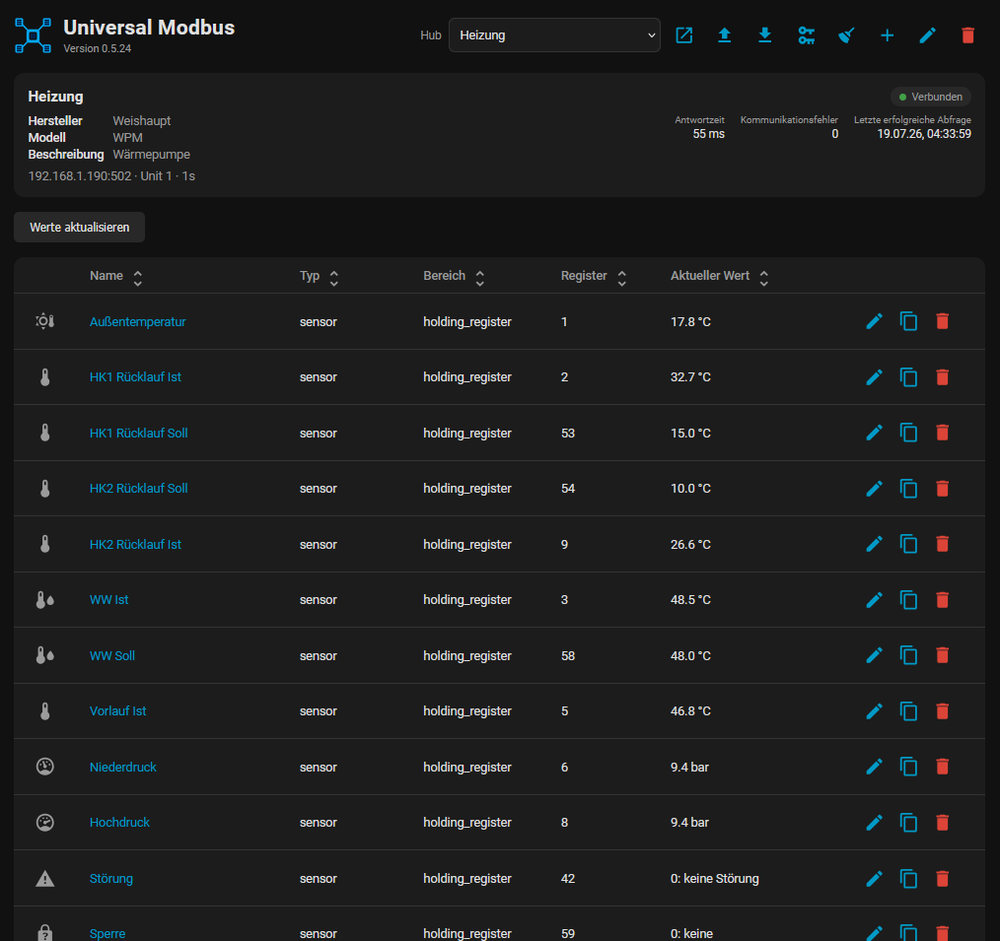
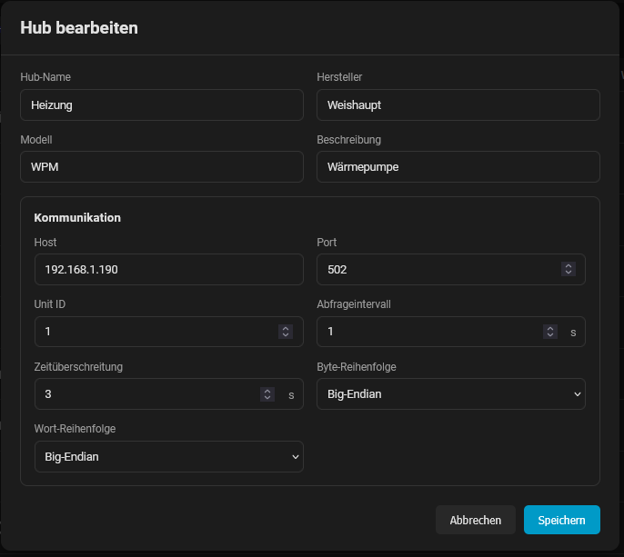
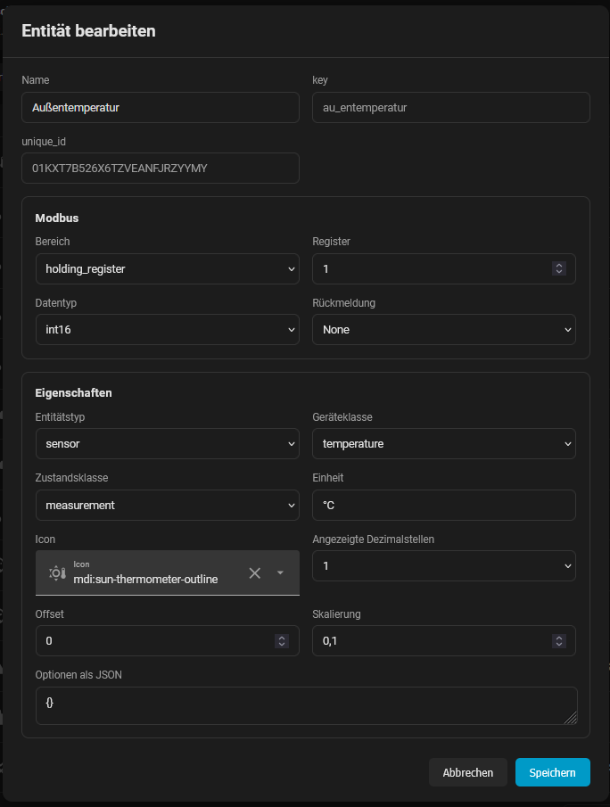

<p align="center">
  
</p>

# Universal Modbus

Universal Modbus is a custom Home Assistant integration for Modbus TCP devices.
Connections and entities are configured through the Home Assistant UI; no YAML
configuration is required.

Universal Modbus is developed and maintained by **Edelmann Electronics**.

## Features

- Create and manage multiple Modbus TCP hubs in the sidebar
- Read coils, discrete inputs, holding registers, and input registers
- Write coils and holding registers
- Create `sensor`, `binary_sensor`, `switch`, `button`, `number`, and `select`
  entities, including pulsed ToggleSwitch entities
- Decode `bool`, `int16`, `uint16`, `int32`, `uint32`, `int64`, `uint64`, and `float32` values
- Configure scaling, offsets, byte order, and word order
- Use a separate feedback register for writable entities
- Display and control entity values directly in the sidebar
- Import and export a complete hub
- English and German UI translations

The integration combines overlapping and adjacent reads from the same Modbus
table. A request contains at most 125 registers or 2,000 bits.

## Supported entity types

| Type | Behavior |
| --- | --- |
| `sensor` | Publishes numeric, boolean, or mapped text values. |
| `binary_sensor` | Converts the decoded value to an on/off state. |
| `switch` | Writes configurable on/off values and reports the polled state. |
| `toggle_switch` | Sends an on/off pulse whenever its state is changed. |
| `button` | Writes an on value and can optionally send an off value after a configured pulse duration. |
| `number` | Writes numeric values within the configured minimum, maximum, and step. |
| `select` | Maps labels to integer values and writes the selected value. |

Switches, buttons, numbers, and selects can also be configured as read-only.
Writable entities must use a coil or holding register as their write target.

## Installation

### HACS

1. In HACS, open **Integrations**.
2. Open the menu and select **Custom repositories**.
3. Add `https://github.com/Idelmaeaen/HA-Universal-Modbus` as an
   **Integration** repository.
4. Find and download **Universal Modbus**.
5. Restart Home Assistant.

### Manual installation

Copy `custom_components/universal_modbus` into the Home Assistant configuration
directory so that the final path is:

```text
<config>/custom_components/universal_modbus
```

Restart Home Assistant afterward.

## Initial setup

1. Open **Settings > Devices & services** in Home Assistant.
2. Select **Add integration** and search for **Universal Modbus**.
3. Enter the connection settings:

   | Field | Description | Default |
   | --- | --- | --- |
   | Device name | Name of the Home Assistant hub and device | None |
   | Host | Hostname or IP address of the Modbus TCP server | None |
   | Port | TCP port | `502` |
   | Unit ID | Modbus unit/slave ID (`0` to `247`) | `1` |
   | Scan interval | Polling interval in seconds | `5` |
   | Timeout | Connection timeout in seconds | `3` |

Port, scan interval, and timeout must be positive whole numbers. The port may
not exceed `65535`. Each combination of host, port, and Unit ID can be added
only once.

The device must be reachable during setup. If it is unavailable or all
configured reads fail, Home Assistant retries loading the integration.

## Sidebar editor

Open **Universal Modbus** in the Home Assistant sidebar. From there you can:

- Add, edit, select, and delete hubs
- Configure connection details and device metadata
- Add, duplicate, edit, and delete entities
- Sort entities and open their Home Assistant entity pages
- View connection status, response time, communication errors, and the last
  successful poll
- Refresh values manually and control writable entities
- Remove orphaned Home Assistant entities

**Settings > Devices & services > Universal Modbus > Configure** links to this
editor.

The upload and download buttons import or export the hub configuration and its
entities. For privacy, exports omit the IP address and exporter identity; the IP
address is requested during import.

### Screenshots

Hub overview:



Hub settings:



Entity settings:



## Entity configuration

The editor shows only settings relevant to the selected entity type, register
area, and data type. The most important settings are:

- Name, entity type, icon, and Home Assistant device/state class
- Modbus table and zero-based register address
- Data type, scale, offset, unit, and displayed decimal places
- Optional feedback table and register
- Write commands and pulse duration for switch-like entities
- Minimum, maximum, and step for numbers
- Value mappings for enum sensors and selects

Entity keys are generated from the name and stay unchanged during normal edits.
Regenerating keys changes Home Assistant unique IDs and can affect entity IDs,
history, dashboards, and automations.

### Register areas and data types

| Register area | Access | Supported data types |
| --- | --- | --- |
| Coil | Read/write | `bool` |
| Discrete input | Read-only | `bool` |
| Holding register | Read/write | All supported types |
| Input register | Read-only | All supported types |

`bool`, `int16`, and `uint16` use one bit or register. `int32`, `uint32`, and
`float32` use two registers. `int64` and `uint64` use four registers.

### Addressing and conversion

- Addresses are zero-based and are passed directly to pymodbus. Documentation
  addresses such as `40001` are not converted automatically.
- Register values are calculated as `value = raw value × scale + offset`.
  Writes reverse this calculation before encoding.
- Byte order controls the bytes inside each register. Word order controls the
  registers of a multi-register value. Both settings apply to the complete hub.
- A feedback register lets a writable entity read its state from a different
  Modbus address than its write target.
- Enum sensors can map raw values to text. Select options map displayed labels
  to integer values.

## Error handling and diagnostics

If one register read fails, the affected entity becomes unavailable while
other valid entities continue updating. The sidebar shows the current error.
Each hub also provides diagnostic entities for response time, communication
error count, and the last successful poll.

After a successful write, the integration requests an immediate refresh.

## Known limitations

- Only Modbus TCP is supported; Modbus RTU/serial is not implemented.
- Writes are limited to coils and holding registers.
- Strings, 64-bit values, bitfields, and custom encodings are not supported.
- Device discovery is not implemented.
- The editor does not verify whether an address, data type, or command is valid
  for the physical device.
- A writable entity can currently be assigned a read-only table, but the write
  then fails at runtime.
- A scale of `0` is accepted, but cannot be reversed for writes.

## Contributing

Bug reports and focused pull requests are welcome. Include the Home Assistant
and integration versions, entity configuration, Modbus table and address, and
relevant logs when reporting a reproducible issue.

Do not publish credentials, private device registers, or other sensitive data
in exported hubs, logs, issues, or commits.
